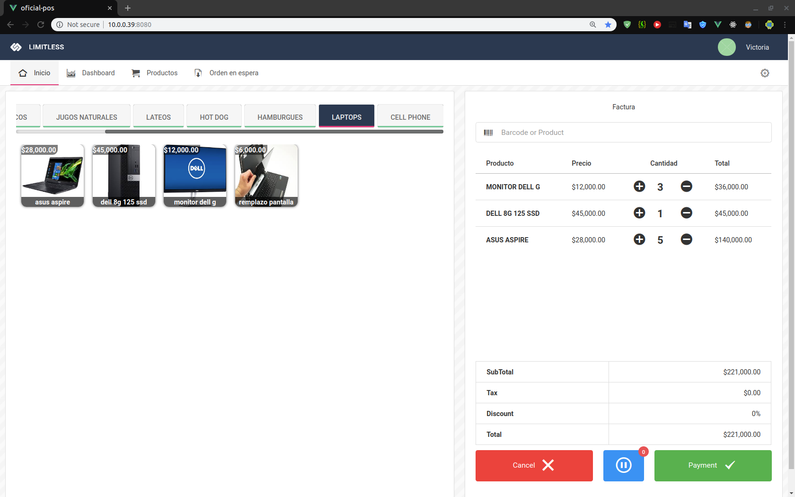

# FortUpPOS


FortUpPOS es un Software en la nube, que permite a nuestros clientes administrar de forma inteligente sus inventarios, hacer ventas ágiles, realizar fidelización de clientes, y analítica desde su móvil, de forma rápida y fácil.
## Project setup
```
npm install
```

### Compiles and hot-reloads for development
```
npm run serve
```

### Compiles and minifies for production
```
npm run build
```

### Run your tests
```
npm run test
```

### Lints and fixes files
```
npm run lint
```

### Customize configuration
See [Configuration Reference](https://cli.vuejs.org/config/).
